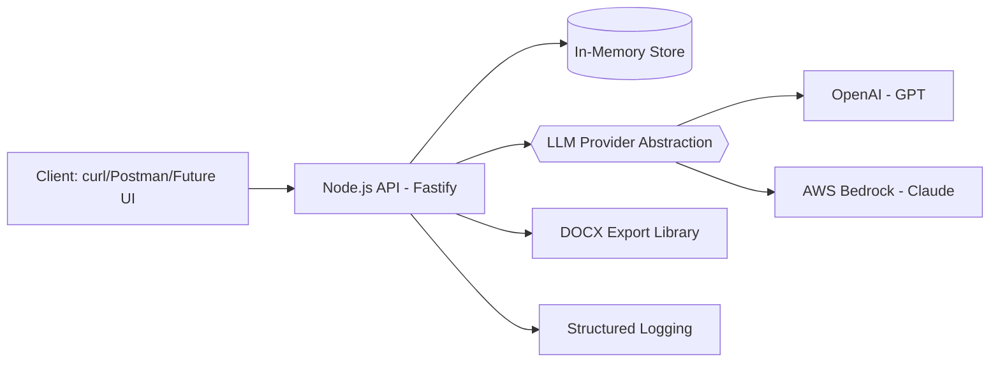

# Architecture

## System Overview

Steno is a single-purpose API service that generates legal demand letters using an LLM provider abstraction: OpenAI (default) or AWS Bedrock (Claude), with a focus on factual accuracy and document formatting.

## High-Level Architecture



## Components

### API Server (`server/index.ts`)
- **Framework**: Fastify (lightweight, fast, TypeScript-friendly)
- **Port**: 8787 (configurable via `.env`)
- **Logging**: Pino via Fastify logger
- **State**: In-memory Map for facts storage (MVP only)

**Responsibilities**:
- Request validation
- Route handling
- Error handling and logging
- Orchestrating calls to Bedrock and DOCX modules

### LLM Provider Abstraction (`server/llm/*`)
- **Interface**: `LlmClient` with `generateDraft()` (+ optional `criticPass`)
- **OpenAI**: `server/llm/openai.ts` – chat.completions, explanations + critic pass
- **Bedrock**: `server/llm/bedrock.ts` – InvokeModel with retries, explanations + critic pass
- **Selection**: `LLM_PROVIDER=openai|bedrock` in `.env` (OpenAI recommended by default)

**Responsibilities**:
- Construct system + user prompts (facts-only; TODOs for missing info)
- Call provider API and parse structured markdown
- Extract explanations for major sections
- Run critic pass to flag unsupported claims
- Provide fallback template if provider unavailable

**Prompt Strategy**:
- **System**: Instructs Claude to be cautious, use only provided facts, insert TODO placeholders for missing info
- **User**: Includes facts JSON, template guidance, firm style preferences, required sections

**Guardrails** (Optional):
- Configured via `BEDROCK_GUARDRAILS_ID` in `.env`
- Blocks: PII/PHI, profanity, off-topic content
- Enforces: Facts-only claims, professional tone

### DOCX Export (`server/docx.ts`)
- **Library**: `docx` (9.x)
- **Markdown Parser**: `marked` + `jsdom`

**Responsibilities**:
- Parse markdown to HTML
- Convert HTML elements to DOCX paragraphs
- Apply proper heading levels (H1→Title, H2→Heading1, etc.)
- Insert letterhead block if provided
- Set page margins (1 inch all sides)
- Return buffer for streaming response

### Schema & Validation (`server/schema/intake.ts`)
- TypeScript interfaces for `FactsJson`, `Parties`, `Damages`
- Basic validation function: checks required fields, types
- Future: Use Zod or JSON Schema for comprehensive validation

### Text Extraction (`server/extract.ts`)
- PDF text extraction via `pdf-parse`
- DOCX text extraction via `mammoth`
- Errors are logged; empty string returned on failure

## Data Flow

### Generate Demand Letter Flow

```
1. Client sends POST /v1/generate with facts_json
   └─> index.ts validates request body

2. index.ts calls `llmClient.generateDraft(facts_json, template_md, firm_style)`
   └─> openai.ts / bedrock.ts constructs prompt

3. Provider processes prompt (OpenAI/Bedrock)
   └─> Returns structured markdown draft

4. Provider parses response, detects TODOs + explanations
   └─> Returns { draft_md, issues }

5. index.ts returns JSON response to client
```

### Export DOCX Flow

```
1. Client sends POST /v1/export/docx with draft_md
   └─> index.ts validates request body

2. index.ts calls markdownToDocxBuffer(draft_md, letterhead)
   └─> docx.ts parses markdown → HTML → DOCX paragraphs

3. docx.ts creates Document with sections
   └─> Packer.toBuffer() generates DOCX binary

4. index.ts streams buffer with appropriate headers
   └─> Client receives demand_letter.docx file
```

## Storage (MVP)

**In-Memory Map**: `factsStore = new Map<string, any>()`

- Key: `facts_{counter}` (e.g., `facts_1`, `facts_2`)
- Value: `{ facts_json, attachments, created_at }`

**Limitations**:
- Data lost on server restart
- No persistence
- No concurrency control
- Single-server only

**Future**: Replace with Redis, PostgreSQL, or DynamoDB for production

## Configuration

All configuration via environment variables (`.env` file):

```ini
# LLM Provider
LLM_PROVIDER=openai
OPENAI_API_KEY=sk-...
OPENAI_MODEL_ID=gpt-4

# (Optional) AWS Bedrock
BEDROCK_REGION=us-east-1
BEDROCK_MODEL_ID=anthropic.claude-3-5-sonnet-20241022-v2:0
BEDROCK_GUARDRAILS_ID=  # Optional

# Server
PORT=8787
LOG_LEVEL=info
```

## Error Handling

### Strategy
- **Validation errors**: 400 Bad Request with descriptive message
- **Not found**: 404 with specific resource identifier
- **Bedrock errors**: 500 Internal Server Error, log details, use fallback if possible
- **Unexpected errors**: 500, log stack trace, return generic message

### Fallback Behavior
- If Bedrock API fails → use `generateFallbackDraft()` with template
- Fallback draft includes TODO placeholders for dynamic sections
- Issues array includes note about fallback usage

## Security Considerations

### Current
- AWS credentials via standard chain (never in code)
- Secrets in `.env` (excluded from git)
- No authentication on API endpoints (localhost only)

### Future
- Bearer token authentication on all endpoints
- Rate limiting per client
- Input sanitization (prevent prompt injection)
- PII redaction in logs (configurable)
- Audit log for all generations (who, when, facts_id)

## Performance Characteristics

### Latency Targets
- **Health check**: < 100ms
- **Intake**: < 200ms (in-memory write)
- **Generate**: < 5s p95 (Bedrock API call)
- **Export DOCX**: < 2s (markdown parsing + DOCX generation)

### Bottlenecks
- **Bedrock API**: Network latency + model inference time (2-4s typical)
- **DOCX generation**: Parsing markdown via jsdom (~100-500ms for large docs)

### Optimization Opportunities
- Cache frequently used templates
- Stream Bedrock responses (currently waits for full completion)
- Parallelize DOCX generation if exporting multiple letters

## Deployment (Future)

### MVP: Local Development
- Run via `npm run dev`
- Access at `http://localhost:8787`

### Production Considerations
- **Container**: Dockerize with multi-stage build
- **Hosting**: AWS ECS Fargate, Lambda (with longer timeout), or EC2
- **IAM**: Service role with Bedrock InvokeModel permission only
- **Monitoring**: CloudWatch logs, X-Ray tracing
- **Secrets**: AWS Secrets Manager or Parameter Store
- **Scaling**: Stateless design allows horizontal scaling

## Technology Choices

| Component | Technology | Rationale |
|-----------|-----------|-----------|
| Runtime | Node.js 18+ | Fast, TypeScript support |
| Framework | Fastify | Lightweight, schema validation, Pino logging |
| LLM | OpenAI (default) / AWS Bedrock | Flexibility, swap providers via env |
| Document Export | `docx` library | Pure JS, no Office dependencies, well-maintained |
| Markdown Parser | `marked` | Fast, standards-compliant, extensible |
| HTML Parser | `jsdom` | Full DOM API for markdown→HTML→DOCX conversion |
| Language | TypeScript (strict) | Type safety, IDE support, catches errors early |

## Extension Points

### Adding New Document Types
- Create new module (e.g., `server/pdf.ts`)
- Add route in `index.ts`: `POST /v1/export/pdf`
- Use similar markdown parsing approach

### Adding Collaboration Features
- Switch to persistent storage (PostgreSQL)
- Add WebSocket support for real-time updates
- Implement OT/CRDT for concurrent editing

### Adding Clause Library
- Create `server/clauses/` directory with JSON clause database
- Add vector embeddings for semantic search
- Integrate retrieval into prompt construction

