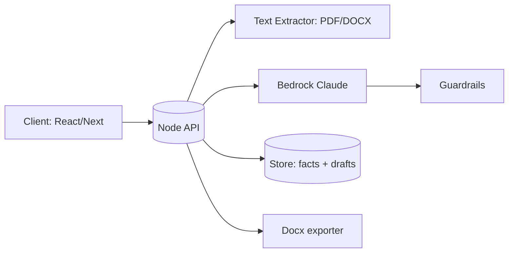

# Steno — Demand Letter Generator (Starter Pack)

A focused, drop‑in starter you can paste into a repo. Includes file tree, acceptance criteria, datasets, prompts, API contracts, evals, and runnable server stubs (Node + Bedrock). Target: **Wednesday‑night MVP**.

---

## 📁 File Tree
```
steno-demand-letter/
├─ README.md
├─ ACCEPTANCE_CRITERIA.md
├─ DATASETS.md
├─ ARCHITECTURE.md
├─ PROMPTS.md
├─ EVALS.md
├─ API_SPEC.md
├─ BACKLOG.md
├─ SECURITY_COMPLIANCE.md
├─ server/
│  ├─ index.ts
│  ├─ bedrock.ts
│  ├─ docx.ts
│  ├─ extract.ts
│  ├─ schema/
│  │  └─ intake.ts
│  ├─ package.json
│  └─ tsconfig.json
├─ client/
│  ├─ README.md
│  ├─ pages/
│  │  └─ demo-notes.md
│  └─ ui/
│     └─ intake-and-editor.md
└─ .env.example
```

---

## README.md
```md
# Steno — Demand Letter Generator (MVP)
Goal: Upload or enter facts, pick a firm template, generate a Word draft in <5s p95, and export DOCX. This MVP focuses on **accuracy to provided facts** and **clear structure** over fancy collaboration.

**Demo Flow**
1) Attorney/paralegal fills an intake form or uploads PDFs (optional text extract)
2) Click Generate → LLM produces a structured draft (markdown)
3) Quick edits (web editor) → Export DOCX, save JSON facts + draft version

**Run the API locally**
```bash
cd server
cp ../.env.example .env # set BEDROCK creds + MODEL_ID + optional GUARDRAILS_ID
pnpm i  # or npm i / yarn
pnpm tsx index.ts
```
```

---

## ACCEPTANCE_CRITERIA.md
```md
P0 (Must)
- Intake endpoint persists facts_json with validation
- Generate endpoint returns a draft containing: intro, statement of facts, liability, damages (specials/generals), demand, deadline, exhibits list
- DOCX export from returned markdown (letterhead block + pagination)
- p95 end-to-end < 5s for a ~2-page facts input
- Fail-safe: if missing facts, bracketed TODO placeholders appear (no hallucinations)

P1 (Should)
- Change log / versioning (draft v1, v2)
- Short “why included” notes per major clause
- Basic template management (firm style + variables)

Non-Functional
- All inputs/outputs logged with redaction for PII (toggle)
- Guardrails enabled with allow/deny patterns (no personal health info, etc.)
```

---

## DATASETS.md
```md
## What to use now (public sources)
1) CFPB Consumer Complaint Database → export CSV w/ narratives → synthesize **facts_seed.json**
2) Public demand-letter examples/guides from state court websites for structure and headings
3) Adjacent clause corpora (CUAD, LEDGAR) to inform retrieval/style, not direct training

## Repo layout
```
/steno-demand-letter/data
  complaints.csv      # raw
  facts_seed.json     # generated from CSV
  templates/          # public/generic templates
  LICENSES.md         # provenance & licenses
```

## Tiny importer (CSV → JSON)
```python
import csv, json
rows = []
with open('data/complaints.csv', newline='', encoding='utf-8') as f:
    for i, r in enumerate(csv.DictReader(f)):
        if i >= 1000: break
        rows.append({
          'parties': {'plaintiff':'Consumer','defendant':(r.get('company') or 'Unknown').strip()},
          'incident': (r.get('consumer_complaint_narrative') or '').strip(),
          'damages': {'amount_claimed': None},
          'venue': (r.get('state') or '').strip(),
          'category': (r.get('product') or '').strip()
        })
open('data/facts_seed.json','w',encoding='utf-8').write(json.dumps(rows, indent=2))
```
```

---

## ARCHITECTURE.md
```md


Notes
- Keep generation stateless; persist inputs/outputs for versioning
- Guardrails enforce: cite only provided facts; bracket TODOs when missing
```

---

## PROMPTS.md
```md
System
You are a cautious legal drafting assistant. Base all assertions strictly on provided facts. If facts are missing, insert [TODO: ...] brackets. Use a concise, professional tone.

Instruction
Given {facts_json} and {firm_style}, produce a demand letter with:
- recipient block, date
- intro
- statement of facts (only supported facts)
- liability
- damages (specials + generals)
- demand + deadline
- exhibits list with references to attachments if provided
Return **markdown** with stable section headings.

Critic pass
Re-read the draft. List any sentences that lack support in facts_json. If any → include a short “Issues” appendix.
```

---

## API_SPEC.md
```md
POST /v1/intake -> {facts_json, attachments[]}
  200 -> {facts_id}

POST /v1/generate -> {facts_id, template_md, firm_style}
  200 -> {draft_md, citations:[], issues:[]}

POST /v1/export/docx -> {draft_md, letterhead?}
  200 -> application/vnd.openxmlformats-officedocument.wordprocessingml.document

GET /v1/templates -> list
POST /v1/templates -> upsert
```

---

## EVALS.md
```md
Suite (20 cases total)
- Tracks: consumer billing, deposit return, debt collection, generic demand for payment
- Metrics: completeness (sections present), factual fidelity (0 unsupported claims), tone compliance
- Gate: any unsupported claim → FAIL; otherwise average ≥ 80/100
Automation: CLI script that loads facts_seed.json and checks headings/keywords + critic output
```

---

## BACKLOG.md
```md
P0
- Intake + validate facts
- Generate via Bedrock Claude w/ guardrails
- DOCX export with letterhead
- Versioning: save draft v1/v2 per facts_id

P1
- Real-time co-edit (tip-tap/ProseMirror) + change log
- Clause library with jurisdiction tags + retrieval
- Explain clause: hover note generated from prompt rationale

Risks
- Privacy/PII: redact logs; toggle persistence for sensitive runs
- Eval drift: pin model + keep a nightly regression on synthetic set
```

---

## SECURITY_COMPLIANCE.md
```md
- Store secrets in .env; no logs of API keys
- Enable Guardrails to block personal health info and enforce “facts-only” claims
- Retention: purge attachments after export in MVP; make configurable later
- Access: basic token auth for API routes
```

---

## server/package.json
```json
{
  "name": "steno-demand-server",
  "private": true,
  "type": "module",
  "scripts": {
    "dev": "tsx index.ts"
  },
  "dependencies": {
    "fastify": "^4.26.2",
    "jsdom": "^24.0.0",
    "marked": "^12.0.2",
    "docx": "^9.1.0",
    "dotenv": "^16.4.5",
    "aws-sdk": "^2.1581.0"
  },
  "devDependencies": {
    "tsx": "^4.19.0",
    "typescript": "^5.4.5"
  }
}
```

---

## server/index.ts
```ts
import Fastify from 'fastify'
import dotenv from 'dotenv'
import { generateWithBedrock } from './bedrock.js'
import { markdownToDocxBuffer } from './docx.js'

dotenv.config()
const app = Fastify({ logger: true })

app.post('/v1/generate', async (req, rep) => {
  const { facts_json, template_md, firm_style } = (req.body as any) || {}
  const { draft_md, issues } = await generateWithBedrock(facts_json, template_md, firm_style)
  return { draft_md, issues }
})

app.post('/v1/export/docx', async (req, rep) => {
  const { draft_md, letterhead } = (req.body as any) || {}
  const buf = await markdownToDocxBuffer(draft_md, letterhead)
  rep.header('Content-Type','application/vnd.openxmlformats-officedocument.wordprocessingml.document')
  rep.header('Content-Disposition','attachment; filename="demand_letter.docx"')
  return rep.send(buf)
})

app.listen({ port: 8787 })
```

---

## server/bedrock.ts
```ts
// Pseudocode: wire to AWS SDK v3 BedrockRuntime (Claude Sonnet)
export async function generateWithBedrock(facts: any, template_md: string, style: any){
  // Build system + user prompts from PROMPTS.md
  // Apply Guardrails config (GUID in env)
  const draft_md = `# Demand Letter\n\n## Introduction\n[TODO: Insert recipient/date]\n\n## Statement of Facts\n${(facts?.incident||'').slice(0,800)}\n\n## Liability\n[TODO]\n\n## Damages\n- Specials: $[TODO]\n- Generals: $[TODO]\n\n## Demand\nPlease remit $[TODO] within 30 days.\n\n## Exhibits\n- [TODO]\n`
  const issues: string[] = [] // populate from a critic pass in a second call if desired
  return { draft_md, issues }
}
```

---

## server/docx.ts
```ts
import { Document, Packer, Paragraph, HeadingLevel } from 'docx'
import { JSDOM } from 'jsdom'
import { marked } from 'marked'

export async function markdownToDocxBuffer(md: string, letterhead?: string){
  const html = marked(md || '') as unknown as string
  const { window } = new JSDOM(html)
  const doc = new Document()
  const body: Paragraph[] = []

  if (letterhead) body.push(new Paragraph({ text: letterhead }))

  window.document.querySelectorAll('h1,h2,h3,p,li').forEach(el => {
    const text = el.textContent || ''
    if (el.tagName === 'H1') body.push(new Paragraph({ text, heading: HeadingLevel.TITLE }))
    else if (el.tagName === 'H2') body.push(new Paragraph({ text, heading: HeadingLevel.HEADING_1 }))
    else if (el.tagName === 'H3') body.push(new Paragraph({ text, heading: HeadingLevel.HEADING_2 }))
    else body.push(new Paragraph({ text }))
  })

  const pack = await Packer.toBuffer(doc)
  return pack
}
```

---

## server/extract.ts
```ts
// Optional: placeholder for PDF/DOCX text extraction (e.g., pdf-parse, mammoth). Not needed for MVP.
export async function extractTextFromFile(_buf: Buffer, _mime: string){
  return ''
}
```

---

## .env.example
```ini
BEDROCK_REGION=us-east-1
BEDROCK_MODEL_ID=anthropic.claude-3-5-sonnet-20241022-v1:0
BEDROIL_GUARDRAILS_ID=grd-xxxxxxxx
```

